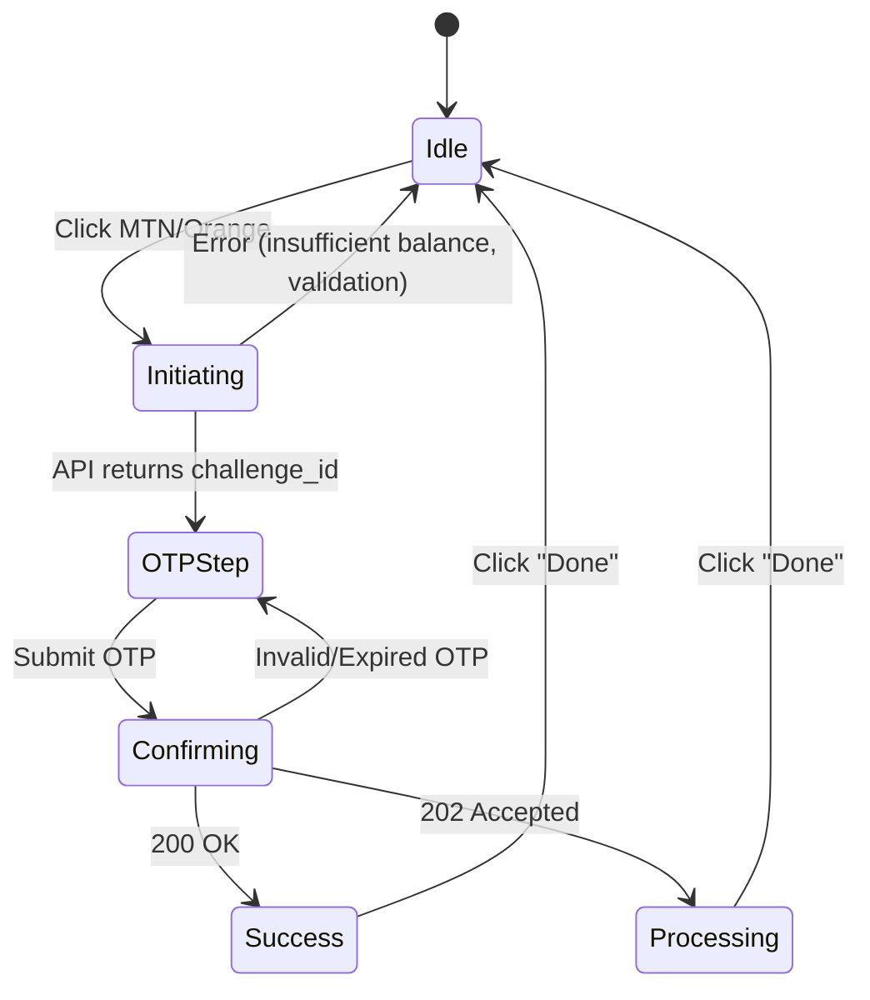

# Withdrawal Flow Integration — Frontend Implementation Plan

Integrate the seller withdrawal mechanism into the WalletModal following the [PAYMENT_FRONTEND_INTEGRATION_GUIDE.md](file:///home/kyler/Desktop/Nothrowam/frontend/NoThrowam-Frontend/Documentations/PAYMENT_FRONTEND_INTEGRATION_GUIDE.md). Since the backend withdrawal endpoints are **not yet ready**, the new service layer will be built with a **simulation toggle** so the UI can be developed and tested now, then switched to the real API with a single flag change.

## User Review Required

> [!IMPORTANT]
> **Phone Number Input:** The API requires a phone number (e.g. `237670123456`) with the withdrawal request. The current WalletModal has no phone number field. A new input will be added. Should we store the phone number in the user profile for reuse, or require it every time?

> [!IMPORTANT]
> **OTP Delivery Channel:** The guide says "OTP sent to your email." The success message in the OTP step will reference email. Confirm this is correct — not SMS-based OTP.

## Proposed Changes

The withdrawal flow from the guide is a **3-step process**:

```
1. Seller enters amount + phone + operator → POST /withdrawals/initiate/
2. Backend sends OTP to seller's email → UI shows OTP input step
3. Seller enters OTP → POST /withdrawals/confirm/ → Success or Processing state
```

This maps to a multi-step wizard inside the WalletModal.

---

### API Config

#### [MODIFY] [api.ts](file:///home/kyler/Desktop/Nothrowam/frontend/NoThrowam-Frontend/src/config/api.ts)

Add payment and withdrawal URL constants:

```typescript
export const API_PAYMENTS_URL = `${API_BASE_URL}/api/v0/payments`;
export const WS_SELLER_PAYMENTS_URL = (sellerId: number, accessToken: string) =>
  `${WS_BASE_URL}/payments/seller/${sellerId}/?token=${encodeURIComponent(accessToken)}`;
```

The websocket URL must include the seller id and the JWT access token, exactly as required by the guide:

```text
wss://<api-host>/ws/payments/seller/<seller_id>/?token=<JWT_ACCESS_TOKEN>
```

---

### New Service

#### [NEW] [withdrawalService.ts](file:///home/kyler/Desktop/Nothrowam/frontend/NoThrowam-Frontend/src/services/withdrawalService.ts)

A new service following the same pattern as `depositService.ts` and `authService.ts`:

- **`SIMULATE` flag** at the top of the file. When `true`, all methods return mock responses after a realistic delay. When `false`, they hit the real API.
- **`initiate(amount, phoneNumber, operator)`** — Calls `POST /api/v0/payments/withdrawals/initiate/`. Returns `{ challenge_id, withdrawal_id, amount, operator }`.
- **`confirm(challengeId, otpCode)`** — Calls `POST /api/v0/payments/withdrawals/confirm/`. Returns success data with `new_balance` or a `202 Accepted` processing state.
- **`getSellerPayments(sellerId)`** — Calls `GET /api/v0/payments/seller/{sellerId}/payments/`. Returns the payment history list.
- Typed interfaces for all request/response shapes (`WithdrawalInitiatePayload`, `WithdrawalInitiateResponse`, `WithdrawalConfirmPayload`, `WithdrawalConfirmResponse`, `SellerPayment`).

---

### Wallet Modal Rewrite

#### [MODIFY] [WalletModal.tsx](file:///home/kyler/Desktop/Nothrowam/frontend/NoThrowam-Frontend/src/Seller_Section/WalletModal.tsx)

Transform the current single-screen modal into a **multi-step withdrawal wizard**.

**New State Machine:**



**Challenge ID Handling:**

The `challenge_id` is generated by the backend when `POST /api/v0/payments/withdrawals/initiate/` succeeds. The frontend must store that exact value for the OTP step and send it back unchanged when confirming the withdrawal.

```typescript
const [challengeId, setChallengeId] = useState<string | null>(null);
```

On initiate success:

```typescript
setChallengeId(response.challenge_id);
setStep('otp');
```

On OTP confirm:

```typescript
if (!challengeId) {
  setError('Withdrawal challenge missing. Please restart the withdrawal.');
  return;
}

await withdrawalService.confirm(challengeId, otpCode);
```

The confirmation request body must be exactly:

```json
{
  "challenge_id": "9eef8b3f-f325-4c71-a0a0-becfefaf67ef",
  "otp_code": "123456"
}
```

Do **not** use `withdrawal_id` for confirmation. `withdrawal_id` may be kept for display or diagnostics, but `challenge_id` is the required value for `POST /api/v0/payments/withdrawals/confirm/`.

**New UI Elements Required:**

| # | Element | Description | Design Notes |
|---|---------|-------------|--------------|
| 1 | **Phone Number Input** | Text input with country code prefix (`+237`) | Placed below the amount input. Same premium styling — `bg-gray-50`, `border-2`, `rounded-2xl`, `font-black`. |
| 2 | **Operator Selector** | Visual toggle between MTN MoMo and Orange Money | Replace the current two separate buttons with a segmented toggle that highlights the selected operator before initiating. Maintains the yellow/orange brand colors. |
| 3 | **"Initiate Withdrawal" Button** | Single primary action button | Emerald green, `rounded-2xl`, full-width, disabled when amount/phone/operator are invalid. Replaces the current dual-button layout. |
| 4 | **OTP Input Step** | 6-digit code input with "Check your email" instruction | Slides in after initiation. Uses individual digit boxes (6 × `w-12 h-14` inputs) with auto-focus advance. Emerald accent border on focus. Includes a countdown timer for OTP expiry. |
| 5 | **OTP Expiry Notice** | Shows that the code may expire and that the seller can restart the withdrawal if needed | The guide does not define a resend endpoint, so do not implement resend unless the backend adds one. |
| 6 | **Back/Cancel Button** | Arrow-left button to go back to the amount step | Top-left of the OTP step, allows the user to cancel and re-enter details. |
| 7 | **Success Overlay** | ✅ Animated confirmation modal (already exists) | Extend the current `successData` overlay to show `reference_id` and `new_balance`. Add a subtle confetti/pulse animation. |
| 8 | **Processing State** | ⏳ Clock-style "still processing" overlay | Similar to success but with a spinning clock icon and an amber/orange color scheme. Shown on `202 Accepted`. |
| 9 | **Inline Error Messages** | Red text below inputs (already implemented) | Extend to cover: insufficient balance (show `available_balance`), invalid OTP, expired OTP, network errors. |

**Props Changes:**

```typescript
interface WalletModalProps {
  onClose: () => void;
  balance?: number;
  sellerId?: number;  // NEW — needed for payment history API
}
```

---

### Seller Dashboard Wiring

#### [MODIFY] [SellerDashboard.tsx](file:///home/kyler/Desktop/Nothrowam/frontend/NoThrowam-Frontend/src/Seller_Section/SellerDashboard.tsx)

- Pass the `userId` (already fetched on line 183) as the `sellerId` prop to `WalletModal`.
- Open the seller payment websocket when the seller dashboard loads, using the seller id and JWT access token.
- Render the initial `payments_list` websocket payload.
- Update matching payment rows when `payment.updated` events arrive.
- If the websocket reconnects, reload `GET /api/v0/payments/seller/{sellerId}/payments/` and resume listening for `payment.updated`.

---

### Transaction History (Future-Ready)

#### [MODIFY] [WalletModal.tsx](file:///home/kyler/Desktop/Nothrowam/frontend/NoThrowam-Frontend/src/Seller_Section/WalletModal.tsx)

- Replace hardcoded dummy transactions with data from `withdrawalService.getSellerPayments()`.
- In simulation mode, the service returns realistic mock data matching the API schema (`id`, `transaction_id`, `amount`, `commission`, `seller_credit`, `status`, `created_at`).
- Map the API `SellerPayment` type to the existing `Transaction` interface for rendering.
- Treat websocket events as the source of truth for payment status once the real backend is enabled.

---

## Verification Plan

### Automated Tests

```bash
# Verify the project compiles with no errors
npm run build
```

### Manual Verification (Browser)

1. **Happy path:** Enter amount → select operator → enter phone → click Initiate → enter OTP `123456` → see success overlay with amount & reference.
2. **Insufficient balance:** Enter amount larger than balance → see inline red error immediately.
3. **Invalid amount:** Enter 0 or negative → see inline red error.
4. **Empty phone:** Leave phone blank → initiate button stays disabled.
5. **Wrong OTP:** Enter incorrect code → see inline error "Invalid OTP", input clears.
6. **Back navigation:** From OTP step, click back → returns to amount/phone step with values preserved.
7. **Processing state:** Simulate `202 Accepted` → see processing overlay with amber clock.
8. **Challenge ID:** Initiate withdrawal → verify `response.challenge_id` is stored → confirm OTP → verify confirm request sends `challenge_id` and `otp_code`, not `withdrawal_id`.
9. **Transaction history:** Open wallet → see simulated transactions rendered from the service.
10. **Seller websocket:** With real backend enabled, open dashboard → verify websocket URL includes `?token=<JWT_ACCESS_TOKEN>` and payment rows update from `payment.updated`.

### Visual Verification

- Take screenshots of each step to confirm premium aesthetic consistency (emerald palette, rounded corners, font-black typography, glassmorphism).
- Verify mobile responsiveness at 375px width.
